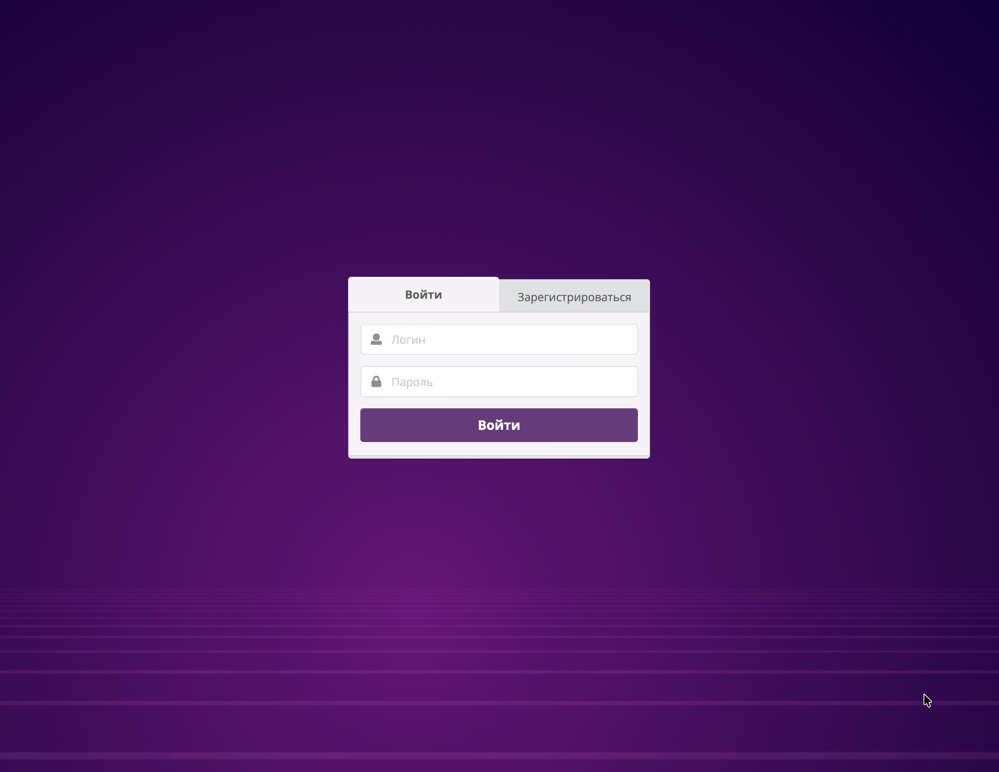
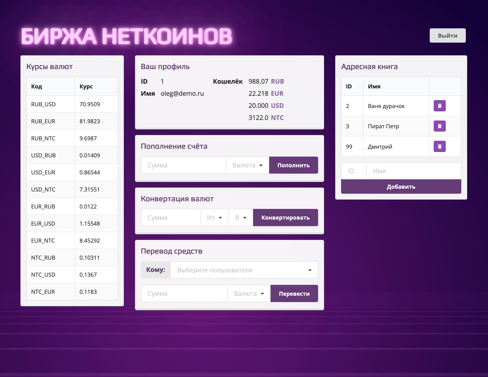

<div id="badges" align = "center">
  <a src = "https://github.com/potykalov">
  
</a>
  <a src = "mailto:dmitriy.potykalov@gmail.com">
    
  </a>
  <a src = "https://t.me/dmitriy_potykalov">
    
  </a>
  <a src = "https://www.linkedin.com/in/potykalov">
    
  </a>
</div>

# Неткоин - сайт-биржа для крипто-стартапа

<div align="center">
  
  
  
</div>

<br>

**Неткоин** - учебное веб-приложение для управления внутренней валютой крипто-стартапа.  
Пользователь может зарегистрироваться, войти в личный кабинет, посмотреть баланс, пополнить счёт, конвертировать валюту, перевести средства другому пользователю и управлять списком избранных получателей.

Проект выполнен как дипломная работа по курсу **«Основы JavaScript»**. Главная задача - связать готовый интерфейс с серверным API: отправлять данные пользователя на сервер и отображать полученную информацию в браузере.

<br>

<div align='center'>


</div>

<br>

## Статус проекта

✅ Завершён как учебный дипломный проект.

<br>

## Функционал

- регистрация нового пользователя;
- авторизация по логину и паролю;
- выход из личного кабинета;
- получение и отображение профиля пользователя;
- просмотр баланса;
- пополнение счёта;
- конвертация валют;
- перевод средств другому пользователю;
- получение и обновление курсов валют;
- добавление пользователей в избранное;
- удаление пользователей из избранного;
- вывод сообщений об успешных действиях и ошибках.

<br>

## Технологии

- **JavaScript** — клиентская логика приложения.

<br>

## Установка

1. Клонируйте репозиторий:

```bash
git clone https://github.com/potykalov/bjs-diplom.git
```

2. Перейдите в папку проекта:

```bash
cd bjs-diplom
```

3. Установите зависимости:

```bash
npm install
```

<br>

## Запуск

1. Запустите локальный сервер:

```bash
npm start
```

2. После запуска в терминале должно появиться сообщение:

```bash
Server started at 8000
```

3. Откройте проект в браузере:

```text
http://localhost:8000
```

4. Для остановки сервера нажмите:

```bash
Ctrl + C
```

<br>

## Тестовые пользователи

Для быстрой проверки можно использовать готовые аккаунты:

| Логин | Пароль |
|---|---|
| `oleg@demo.ru` | `demo` |
| `ivan@demo.ru` | `demo` |
| `petr@demo.ru` | `demo` |
| `galina@demo.ru` | `demo` |
| `vladimir@demo.ru` | `demo` |

Также можно зарегистрировать нового пользователя через форму регистрации.

<br>

## Реализация

В рамках дипломной работы я реализовал клиентскую логику, которая связывает готовый интерфейс с серверным API.

- подключил авторизацию и регистрацию пользователя;
- реализовал выход из личного кабинета;
- настроил получение и отображение данных текущего пользователя;
- подключил обновление курсов валют;
- реализовал пополнение баланса;
- реализовал конвертацию валют;
- реализовал перевод средств другому пользователю;
- подключил добавление и удаление пользователей из избранного;
- настроил вывод сообщений об успешных действиях и ошибках;
- синхронизировал список избранных пользователей со списком получателей для перевода.

<br>

## Структура проекта

Mermaid-схема

<br>

## Интерфейс

### Страница входа


### Личный кабинет


### Операции с балансом


### Избранные пользователи


<br>

## 📄 Лицензия

Проект распространяется под лицензией MIT.  
Подробнее см. файл [LICENSE](LICENSE).

<br>

## Автор

**Дмитрий Потыкалов**

Frontend-разработчик

<br>

<div id="badges" align = "center">
  <a src = "https://github.com/potykalov">
  
</a>
  <a src = "mailto:dmitriy.potykalov@gmail.com">
    
  </a>
  <a src = "https://t.me/dmitriy_potykalov">
    
  </a>
  <a src = "https://www.linkedin.com/in/potykalov">
    
  </a>
  <br>
  
</div>
